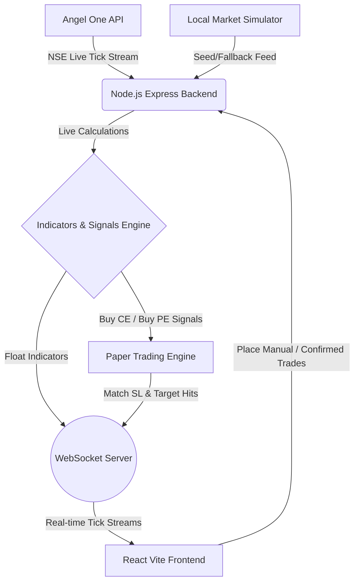

# NIFTY 50 Options Trading & Signal Analysis Dashboard

A local, full-stack application built for real-time NIFTY 50 options trading analysis, technical indicator calculations, automated rule-based signal generation, paper trading matching, and risk management control, with optional integration into Angel One SmartAPI.

---

## Architecture & Components



1. **High-Fidelity Local Simulator**: Runs dynamically to generate real-time index spot price ticks, computes options chains (LTP, OI changes, volume) for 11 strikes around ATM, and pre-populates 50 candles on boot so technical indicators are active immediately.
2. **Technical Calculations Engine**: Aggregates tick feeds into 1-minute candles and computes **VWAP**, **EMA 20**, **EMA 50**, **Support & Resistance ranges**, and **Volume multipliers** in real-time.
3. **Automated CE/PE Signal Engine**: Evaluates criteria (price relative to VWAP, EMA crossover directions, support/resistance breakouts, and call/put OI changes) to output `BUY CE` / `BUY PE` recommendations with confidence scoring (0-100%) and textual explanations.
4. **Paper Trading matching engine**: Simulates buying options premium contracts, logs margin costs, evaluates SL/Target bounds, and performs automated risk halts.
5. **Risk Management Safeguard**: Restricts max daily trade count and daily loss threshold (locks trading and auto-closes open positions if breached).
6. **Zerodha Kite-Style React View**: Rich glassmorphic panels for option chains, signal indicators, virtual balances, floating positions, equity curves, and credential configurations.

---

## Tech Stack

- **Frontend**: React (Vite), Tailwind CSS v3, Chart.js, Lucide Icons, Canvas Confetti.
- **Backend**: Node.js, Express, WebSocket (`ws`), Angel One `smartapi-javascript` SDK, `otplib` (for automated 2FA login verification).

---

## Project Structure

```
Trade/
├── backend/
│   ├── src/
│   │   ├── index.js             # Express app, WebSocket setup, tick broadcasts
│   │   ├── config.js            # Trading, indicators, risk, and API credentials configurations
│   │   ├── services/
│   │   │   ├── angelone.js      # SmartAPI login lifecycle, live feed stream, order placement
│   │   │   ├── simulator.js     # High-fidelity mock price generator
│   │   │   ├── signalEngine.js  # VWAP, EMA, breakout levels, option chain OI analyzer
│   │   │   ├── paperTrader.js   # Paper trading position matching and history database
│   │   │   └── riskManager.js   # Daily trade count and daily stop-loss controller
│   │   └── routes/
│   │       └── api.js           # REST routers
│   ├── .env.example
│   └── package.json
├── frontend/
│   ├── src/
│   │   ├── components/          # Dashboard modular cards (OptionChain, MarketWatch, Header, etc.)
│   │   ├── services/            # API fetcher and WebSocket stream listeners
│   │   ├── App.jsx              # Dashboard orchestrator
│   │   ├── index.css            # Base Tailwind and visual flash styles
│   │   └── main.jsx
│   ├── package.json
│   ├── tailwind.config.js
│   └── vite.config.js
└── README.md
```

---

## Setup & Launch Instructions

### Prerequisites
- **Node.js** (v18 or higher recommended)
- **npm** (comes packaged with Node)

### 1. Install Backend Dependencies
Navigate to the `backend` folder and install dependencies:
```bash
cd backend
npm install
```

### 2. Configure Environment Variables
Create a `.env` file in the `backend/` directory by copying `.env.example`:
```bash
cp .env.example .env
```
Open `.env` and fill in your details if you wish to connect to Angel One. If you leave it as default, the **Local Simulator** will drive the app autonomously.

### 3. Install Frontend Dependencies
Navigate to the `frontend` folder and install dependencies:
```bash
cd ../frontend
npm install
```

### 4. Run the Application
You need to start both the backend server and the frontend dev server.

**Start Backend Server:**
Open a terminal in the `backend` folder and run:
```bash
npm run dev
```
*(Runs backend server on `http://localhost:5000`)*

**Start Frontend App:**
Open a second terminal in the `frontend` folder and run:
```bash
npm run dev
```
*(Launches React UI on `http://localhost:5173` or similar. Open this link in your browser)*

---

## Verification & Testing

To run the standalone unit/calculation test suite for the technical indicators and signal processing engine:
```bash
cd backend
node src/test-indicators.js
```
Expected output:
```
=== Running Technical Indicator and Signal Engine Tests ===
Testing EMA-20 Calculation:
✔ EMA-20 calculation matches expected boundaries!

Testing Support/Resistance Calculation:
✔ Support/Resistance calculation matches expected peaks/troughs!

Testing Signal Engine (analyzeSignal):
✔ Signal engine successfully triggered BUY CE on breakout and support writing!
=== Technical Tests Complete ===
```
